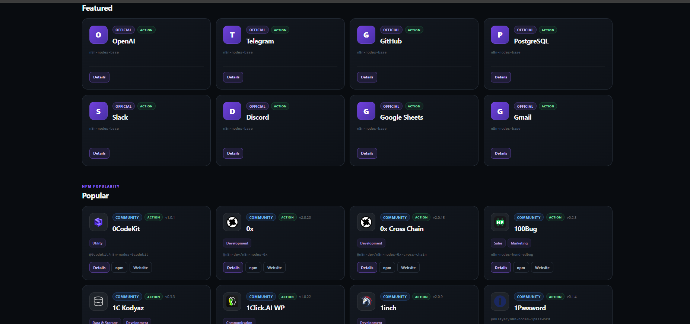

# n8n Atlas

**Discover and explore official and community integrations across the n8n ecosystem.**

[](https://mr-amirasgari.github.io/n8n-atlas/)
[](https://github.com/mr-amirasgari/n8n-atlas/actions/workflows/update-atlas.yml)

🌐 **Live:** https://mr-amirasgari.github.io/n8n-atlas/

n8n Atlas is an open-source directory for discovering, searching, and exploring official and community n8n integrations.

Instead of maintaining the catalog manually, n8n Atlas automatically collects package metadata, enriches community-node information, extracts available icons and categories, builds the catalog, and deploys the updated website through GitHub Actions.

---

## Preview



---

## Features

- 🔎 Fast fuzzy search powered by Fuse.js
- 🧩 Official and community n8n integrations
- 🗂️ Category filtering
- ⚡ Action and Trigger filtering
- 🚦 Active and Deprecated status filtering
- ⭐ Curated Featured integrations
- 📈 Popular community integrations
- 🖼️ Integration icons with automatic fallback
- 📄 Dedicated detail page for each integration
- 📦 npm package metadata and useful external links
- 🔄 Automatically refreshed catalog
- 🚀 Automated deployment with GitHub Pages
- 🌐 Fully static frontend — no backend required

---

## How It Works

n8n Atlas uses a Python-based data pipeline to build the catalog.

```text
Official n8n packages
        │
        ├── collect_official.py
        │
npm community packages
        │
        ├── collect_community.py
        │
        ▼
Community package metadata
        │
        ├── enrich_community.py
        │
        ▼
Icons + categories
        │
        ├── extract_icons.py
        │
        ▼
Unified catalog
        │
        ├── build_catalog.py
        │
        ▼
data/catalog.json
        │
        ▼
Static n8n Atlas website
```

Community package archives are inspected for metadata and assets without intentionally executing third-party community-node code.

---

## Discovery

n8n Atlas is designed to make a large integration catalog easier to explore.

### Search

Search across integration names, package names, descriptions, categories, publishers, and node types.

Fuzzy matching also helps with small spelling mistakes.

For example:

```text
telgram
open ai
postgress
```

can still surface relevant results.

### Filters

Integrations can currently be filtered by:

- Official / Community
- Category
- Action / Trigger
- Active / Deprecated

### Featured

A curated collection of commonly used official integrations is highlighted separately.

### Popular

Community integrations can also be discovered using npm popularity metadata.

---

## Integration Details

Each integration has its own detail view:

```text
node.html?id=<integration-id>
```

The detail page can include:

- Integration name
- Package name
- Version
- Source
- Publisher
- License
- Categories
- Node type
- Verification status
- Deprecation status
- npm popularity metrics
- Description
- Package / GitHub / Website links
- Technical metadata

---

## Project Structure

```text
n8n-atlas/
│
├── .github/
│   └── workflows/
│       └── update-atlas.yml
│
├── assets/
│   └── icons/
│       └── community/
│
├── css/
│   ├── base.css
│   ├── catalog.css
│   ├── components.css
│   ├── detail.css
│   ├── responsive.css
│   └── style.css
│
├── data/
│   ├── catalog.json
│   ├── community-assets.json
│   ├── community-enriched.json
│   ├── community-nodes-raw.json
│   ├── community-nodes.json
│   └── nodes.json
│
├── js/
│   ├── app.js
│   └── node.js
│
├── scripts/
│   ├── build_catalog.py
│   ├── collect_community.py
│   ├── collect_official.py
│   ├── enrich_community.py
│   └── extract_icons.py
│
├── tests/
│   ├── test_catalog_features.py
│   └── test_extract_icons.py
│
├── vendor/
│   ├── fuse.min.js
│   └── FUSE-LICENSE
│
├── index.html
├── node.html
└── README.md
```

---

## Automated Updates

The GitHub Actions workflow keeps the project updated automatically.

It can run:

- On pushes to `main`
- Manually with `workflow_dispatch`
- On a scheduled daily update

The pipeline:

1. Collects official nodes
2. Collects community packages
3. Enriches community metadata
4. Extracts icons and categories
5. Rebuilds the catalog
6. Commits updated generated data when necessary
7. Builds the static website
8. Deploys to GitHub Pages

---

## Run Locally

Clone the repository:

```bash
git clone https://github.com/mr-amirasgari/n8n-atlas.git
cd n8n-atlas
```

Start a local static server:

```bash
python -m http.server 8000
```

Then open:

```text
http://localhost:8000
```

---

## Rebuild the Catalog

The individual pipeline steps can also be executed manually:

```bash
python scripts/collect_official.py
python scripts/collect_community.py
python scripts/enrich_community.py --workers 8
python scripts/extract_icons.py
python scripts/build_catalog.py
```

Then serve the website locally:

```bash
python -m http.server 8000
```

---

## Tech Stack

- **Python** — data collection and processing
- **JavaScript** — frontend logic
- **Fuse.js** — fuzzy search
- **HTML / CSS** — static frontend
- **GitHub Actions** — automation
- **GitHub Pages** — hosting

No application backend or database server is required.

---

## Contributing

Contributions, bug reports, and ideas are welcome.

If you find an issue or have an idea for improving n8n Atlas:

1. Open an Issue
2. Describe the problem or suggestion
3. Submit a Pull Request if you'd like to contribute a fix

---

## Links

🌐 **Live Website**  
https://mr-amirasgari.github.io/n8n-atlas/

💻 **GitHub Repository**  
https://github.com/mr-amirasgari/n8n-atlas

---

Built to make the n8n ecosystem easier to explore.